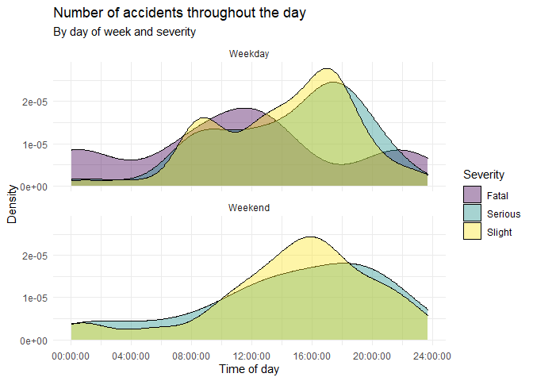
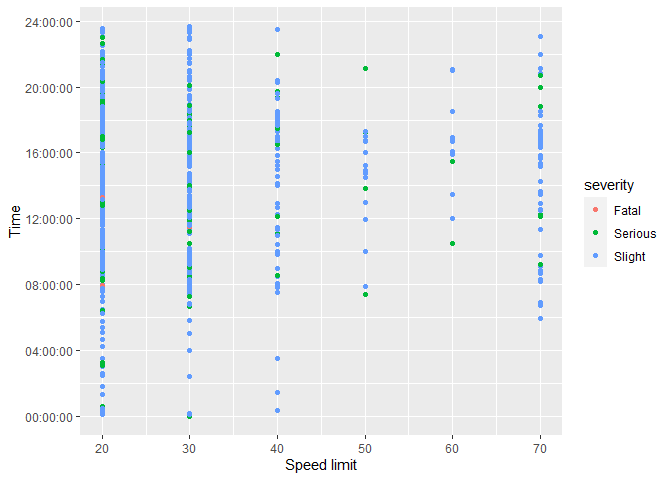

Домашнее задание 03 - Дорожные происшествия
================
Фигурова Анастасия
03.12.2021

В этом задании мы рассмотрим дорожные происшествия в Эдинбурге. Данные
сделаны доступными
[online](https://data.gov.uk/dataset/cb7ae6f0-4be6-4935-9277-47e5ce24a11f/road-safety-data/datafile/36f1658e-b709-47e7-9f56-cca7aefeb8fe/preview)
Правительством Великобритании. Данные покрывают все дорожные
происшествия в Эдинбурге за 2018 год, некоторые переменные
были модифицированы для настоящего задания.

## Данные

Данные содержатся в пакете **dsbox** в объекте `accidents`. Для доступа
к этим данным достаточно загрузить пакет. Узнать больше о структуре
набора данных можно, обратившись к документации, для чего в консоли
нужно набрать `?accidents`. Эту информацию также можно найти
[здесь](https://rstudio-education.github.io/dsbox/reference/accidents.html).

## Загрузка пакетов и данных

``` r
library(tidyverse)
library(dsbox)
```

## Упражнения

### Упражнение 1

Сколько наблюдений (строк) содержится в наборе данных? Для ответа
используйте код-в-строке (inline code).

-----

``` r
nrow(`accidents`)
```

    ## [1] 768

### Упражнение 2

Выполните выражение `View(accidents)` в консоли для просмотра данных на
панели источников. Что представляет собой каждая строка в наборе
данных?

-----

``` r
View(accidents)
```

Строка в наборе данных представляет собой зарегестрированное дорожное
происшествие.

### Упражнение 3

Воссоздайте следующий график, опишите его в контексте данных.


Не забудьте переименовать фрагмент кода (там, где сейчас указано
`label-me-1`). Имя должно быть коротким, информативным и не должно
содержать пробелов, а также не должно повторять имя предыдущего
фрагмента.

-----

``` r
v <- accidents$day_of_week == "Saturday" | accidents$day_of_week == "Sunday"
accidents %>%
  mutate(day = "Weekday")
```

    ## # A tibble: 768 x 32
    ##    id         easting northing longitude latitude police_force severity vehicles
    ##    <chr>        <dbl>    <dbl>     <dbl>    <dbl>        <dbl> <fct>       <dbl>
    ##  1 201895000~  327174   670941     -3.17     55.9           95 Slight          1
    ##  2 201895000~  324874   672457     -3.20     55.9           95 Slight          1
    ##  3 201895000~  330500   671750     -3.11     55.9           95 Slight          2
    ##  4 201895000~  321890   671640     -3.25     55.9           95 Slight          3
    ##  5 201895000~  320120   669330     -3.28     55.9           95 Slight          2
    ##  6 201895000~  331752   667988     -3.09     55.9           95 Slight          3
    ##  7 201895000~  325523   674024     -3.19     56.0           95 Slight          1
    ##  8 201895000~  329230   675270     -3.14     56.0           95 Slight          1
    ##  9 201895000~  327187   674441     -3.17     56.0           95 Slight          1
    ## 10 201895000~  326420   672400     -3.18     55.9           95 Slight          2
    ## # ... with 758 more rows, and 24 more variables: casualties <dbl>, date <chr>,
    ## #   day_of_week <fct>, time <time>, district <dbl>, highway <chr>,
    ## #   first_road_class <fct>, first_road_number <chr>, road_type <fct>,
    ## #   speed_limit <dbl>, junction_detail <chr>, junction_control <chr>,
    ## #   second_road_class <chr>, second_road_number <chr>, ped_cross_human <chr>,
    ## #   ped_cross_physical <chr>, light <fct>, weather <fct>, road_surface <fct>,
    ## #   special_condition <fct>, hazard <fct>, urban_rural <dbl>, police <chr>, ...

``` r
accidents %>%
  mutate(week = if_else(v, "Weekend", "Weekday"))%>%
ggplot(aes(x = time, fill = severity)) + 
  geom_density(alpha = 0.4) +
  theme_minimal() +
  facet_wrap(~week, ncol = 1) +
  scale_fill_viridis_d() +
labs(
  title = "Number of accidents throughout the day",
  subtitle = "By day of week and severity",
  x = "Time of day",
  y = "Density",
  fill = "Severity"
)
```

<!-- -->

### Упражнение 4

Создайте другую визуализацию на основе данных и дайте интерпретацию. Вы
можете использовать любые переменные любого типа, но их должно быть не
меньше трех, то есть диаграммы рассеяния `x` vs. `y` недостаточно, но
если точки будут раскрашены в соответствии с `z`, это нормально. Не
забудьте переименовать фрагмент кода (там, где сейчас указано
`label-me-2`).

-----

Замените этот текст на ответ к Упражнению 4.

``` r
ggplot(data = accidents, 
       mapping = aes(x = speed_limit, y = time,
                     colour = severity)) +
  geom_point() +
  labs(x = "Speed limit", y = "Time")
```

<!-- --> Больше всего аварий
происходит при ограничениях скорости = 20 км/ч и 30 км/ч,
наименьшее количество аварий происходит при органичениях
скорости = 60 и 50 км/ч. Две наиболее серьезные аварии пришлись на
промежуток времени с 8 утра до 13 дня, при ограничении скорости 20 км/ч.
Наименьшее количество дорожный происшествий приходится на промежуток
времени с 00:00 до приблизительно 05:00. Наибольшее количество
дорожный происшествий приходится на промежуток времени примерно с
07:00 до 19:00-20:00. В большинстве случаев дорожные происшествия были
несерьезными.
